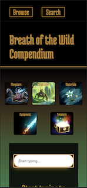

# Breath Of the Wild Compendium
A web application based on the most recent (and, some will say, the *most popular*) game in The Legend of Zelda franchise - **The Legend of Zelda: Breath of the Wild**. Breath of the Wild is an open world action-adventure game with a large variety of collectible items and gear. With an intuitive and easy to use interface, this web application provides a detailed look into each of these avaialble items, along with a brief description and information on where they can be typically found. You will also find information on monsters that appear throughout the game as well as some additional helpful information. 

[Click here for the wikipedia article](https://en.wikipedia.org/wiki/The_Legend_of_Zelda:_Breath_of_the_Wild) to read more about the game!

# Technologies Used 

- HTML5
- CSS3
- JavaScript
- jQuery
- Google Fonts
- Breath of the Wild API 

([Click here](https://gadhagod.github.io/Hyrule-Compendium-API/#/) to view the API documentation)

# Screenshots
### Main Screen

### Alphabetized list of the chosen category

### Search Box

### Search Box in action

### The app is mobile responsive!

## Getting Started
- Click on the categories to display a list of relevant items
- If searching for a specific item: use the search bar below!

[Click here](https://botw-compendium.netlify.app) to see the deployed project

# Future Enhancements

### 1. Include attack and defence stats for equipment and shields!
### 2. Add functionality that allows to search for enemies that provide specific drops
### 3. Include an interactive map that allows to search the database by specific locations and areas.
### 4. Add ability to download pdf version of chosen cards to the computer

# Author
- [Github Profile](https://github.com/polina-g) 
- [Twitter](https://twitter.com/ThisIsPolinaG)
- [LinkedIn](linkedin.com/in/polina-gorbunova-71657170)